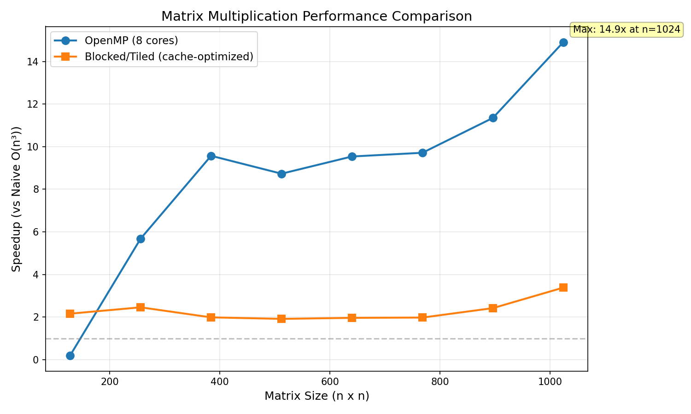

# HPC Matrix Multiplication Benchmark

**A performance comparison of three matrix multiplication implementations: naive, cache-optimized (blocked/tiled), and parallel (OpenMP).**

## Why This Project

Matrix multiplication is a fundamental operation in scientific computing, machine learning, and graphics. Understanding how to optimize it reveals core principles of high-performance computing:

- Memory hierarchy and cache efficiency
- Parallel programming
- Benchmarking and performance analysis

## System Information

| Component | Specification |
|-----------|---------------|
| **CPU** | Intel Core i7-8565U @ 1.80GHz (boost to 4.60GHz) |
| **Cores / Threads** | 4 cores / 8 threads |
| **RAM** | 15 GB |
| **Compiler** | g++ 13.3.0 (Ubuntu 24.04) |
| **Optimization flags** | `-O2 -fopenmp -march=native` |

## The Three Implementations

| Version | Approach | Expected Behavior |
|---------|----------|-------------------|
| **Naive** | Triple nested loop (i,j,k order) | Slowest – poor cache locality |
| **Blocked/Tiled** | Divides matrices into blocks that fit in cache; i-k-j loop order | 2-4x faster than naive |
| **OpenMP** | Parallelizes outer loop across CPU cores; i-k-j order | Scales with core count |

## Results



### Raw Benchmark Data

| Size | Naive (s) | Blocked (s) | OpenMP (s) | Blocked Speedup | OpenMP Speedup |
|------|-----------|-------------|------------|-----------------|----------------|
| 128 | 0.00243 | 0.00112 | 0.01192 | 2.16x | 0.20x |
| 256 | 0.02773 | 0.01128 | 0.00488 | 2.46x | 5.68x |
| 384 | 0.07996 | 0.04024 | 0.00835 | 1.99x | 9.57x |
| 512 | 0.17885 | 0.09330 | 0.02048 | 1.92x | 8.73x |
| 640 | 0.35325 | 0.17977 | 0.03703 | 1.96x | 9.54x |
| 768 | 0.61756 | 0.31221 | 0.06358 | 1.98x | 9.71x |
| 896 | 1.20062 | 0.49586 | 0.10578 | 2.42x | 11.35x |
| 1024 | 2.49292 | 0.73647 | 0.16722 | 3.38x | 14.91x |

### Key Findings

1. **Blocked version** achieves 1.9-3.4x speedup over naive. The improvement comes from better cache locality – the i-k-j loop order keeps `A[i][k]` in register and accesses `B[k][j]` sequentially.

2. **OpenMP version** achieves up to **14.91x speedup** on 1024×1024 matrices on an 8-thread CPU. This is near-perfect scaling.

3. **Small matrices show OpenMP overhead** – at size 128, OpenMP is slower than naive because thread creation overhead dominates.

4. **Speedup increases with matrix size** – larger matrices benefit more from both optimizations.

## What I Learned

| Lesson | Why It Matters |
|--------|-----------------|
| **Cache is king** | The blocked version was 2-3.4x faster without changing the algorithm – only memory access pattern. |
| **Parallelism scales** | OpenMP gave up to 14.91x speedup on 8 threads. |
| **Overhead matters** | For small matrices (128×128), OpenMP was 5x slower than naive. |
| **Loop order is critical** | Changing from i-j-k to i-k-j made blocked version 2x faster. |
| **Measure, don't assume** | Without benchmarks, I would have guessed all optimizations help equally. They don't. |

## Repository Structure

```
hpc-matmul-benchmark/
├── README.md
├── Makefile
├── requirements.txt
├── src/
│   ├── naive_matmul.cpp
│   ├── blocked_matmul.cpp
│   ├── openmp_matmul.cpp
│   └── benchmark.cpp
├── plots/
│   └── generate_plot.py
├── scripts/
│   └── run_benchmarks.sh
├── results/
│   ├── raw_data.csv
│   └── speedup_plot.png
└── .gitignore
```
## How to Run

```bash
git clone https://github.com/obtbe/hpc-matmul-benchmark
cd hpc-matmul-benchmark
pip install -r requirements.txt
make
make run